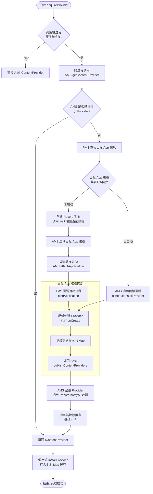

```mermaid
graph TD
    Start([开始: acquireProvider]) --> LocalCache{调用端进程<br/>是否有缓存?}
    
    LocalCache -- 有 --> ReturnLocal[直接返回 IContentProvider]
    LocalCache -- 无 --> CallAMS[跨进程调用<br/>AMS.getContentProvider]

    CallAMS --> AMSCheck{AMS 是否已记录<br/>该 Provider?}
    AMSCheck -- 是 --> ReturnToClient[返回 IContentProvider]
    
    AMSCheck -- 否 --> FindApp[PMS 查找目标 App 信息]
    FindApp --> ProcessCheck{目标 App 进程<br/>是否已启动?}

    %% 场景 A
    ProcessCheck -- "未启动" --> CreateRecord[创建 Record 对象<br/>调用 wait 阻塞当前线程]
    CreateRecord --> StartProcess[AMS 启动目标 App 进程]
    
    StartProcess --> AttachApp[目标进程启动<br/>AMS.attachApplication]
    AttachApp --> BindApp[AMS 回调目标进程<br/>bindApplication]
    
    subgraph TargetProcess [目标 App 进程内部]
        BindApp --> InitProvider[反射创建 Provider<br/>执行 onCreate]
        InitProvider --> SaveTargetLocal[记录到进程本地 Map]
        SaveTargetLocal --> Publish[调用 AMS<br/>publishContentProviders]
    end

    Publish --> AMSNotify[AMS 记录 Provider<br/>调用 Record.notifyAll 唤醒]
    AMSNotify --> Resume[调用端解除阻塞<br/>继续执行]
    Resume --> ReturnToClient

    %% 场景 B
    ProcessCheck -- "已启动" --> ScheduleInstall[AMS 调用目标进程<br/>scheduleInstallProvider]
    ScheduleInstall --> InitProvider
    
    %% 最终返回
    ReturnToClient --> ClientInstall[调用端 installProvider<br/>存入本地 Map 缓存]
    ClientInstall --> End([结束: 获取成功])
```