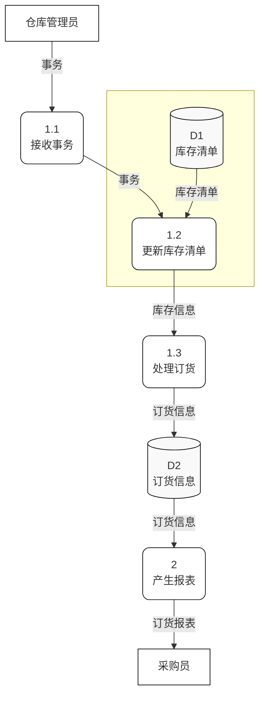

```mermaid
graph TD
    %% --- 定义样式 ---
    %% 设置节点样式让其看起来更像DFD
    classDef process fill:#fff,stroke:#000,stroke-width:1px,rx:10,ry:10;
    classDef store fill:#f9f9f9,stroke:#000,stroke-width:1px;
    classDef entity fill:#fff,stroke:#000,stroke-width:1px;

    %% --- 定义节点 ---
    
    %% 外部实体 (Entity)
    Admin["仓库管理员"]:::entity
    Buyer["采购员"]:::entity

    %% 处理过程 (Process)
    %% 使用 <br> 来模拟图中的上下分割
    P11("1.1<br>接收事务"):::process
    P12("1.2<br>更新库存清单"):::process
    P13("1.3<br>处理订货"):::process
    P2("2<br>产生报表"):::process

    %% 数据存储 (Data Store)
    %% 使用数据库形状代表 D1 和 D2
    D1[("D1<br>库存清单")]:::store
    D2[("D2<br>订货信息")]:::store

    %% --- 定义连线与数据流向 ---
    
    %% 顶部流程
    Admin -->|事务| P11
    P11 -->|事务| P12
    
    %% 与 D1 库存清单的交互
    %% 图中箭头从 D1 指向 1.2
    D1 -->|库存清单| P12
    
    %% 中间流程
    P12 -->|库存信息| P13
    
    %% 与 D2 订货信息的交互
    P13 -->|订货信息| D2
    D2 -->|订货信息| P2
    
    %% 底部流程
    P2 -->|订货报表| Buyer
    
    %% --- 强制布局微调 (可选) ---
    %% 让D1显示在P12旁边 (根据渲染器不同效果可能不同)
    subgraph S1 [ ]
    direction LR
    D1
    P12
    end
```