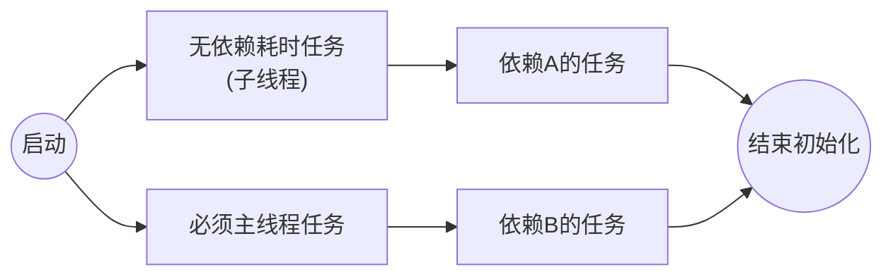

```mermaid
graph LR
    Start(("启动")) --> TaskA["无依赖耗时任务<br/>(子线程)"]
    Start --> TaskB["必须主线程任务"]
    TaskA --> TaskC["依赖A的任务"]
    TaskB --> TaskD["依赖B的任务"]
    TaskC --> End(("结束初始化"))
    TaskD --> End
```