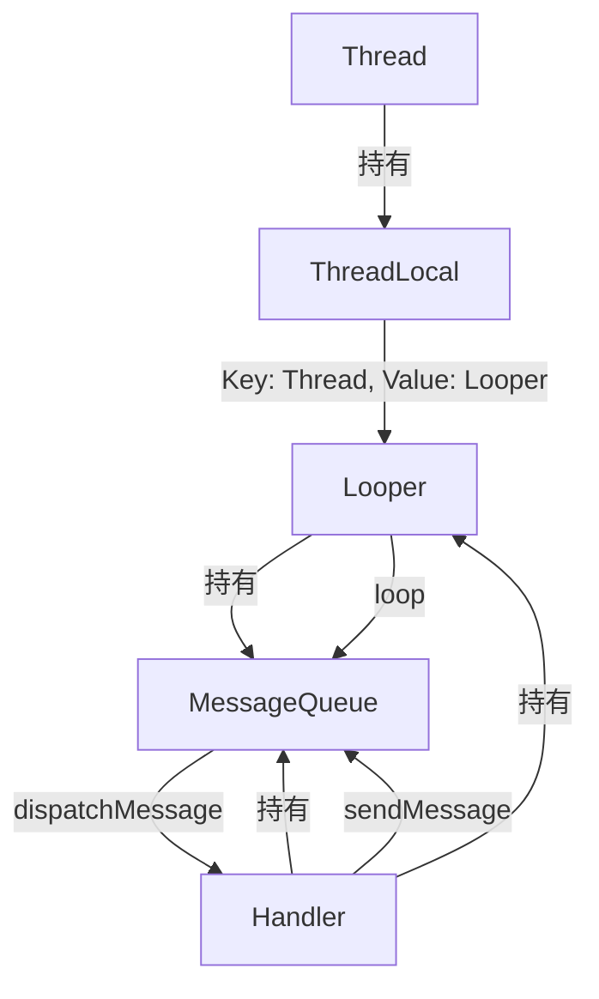

```mermaid
graph TD
    Thread[Thread] -->|持有| TL[ThreadLocal]
    TL -->|Key: Thread, Value: Looper| Looper
    Looper -->|持有| MQ[MessageQueue]
    Handler -->|持有| Looper
    Handler -->|持有| MQ
    Handler -->|sendMessage| MQ
    Looper -->|loop| MQ
    MQ -->|dispatchMessage| Handler
```