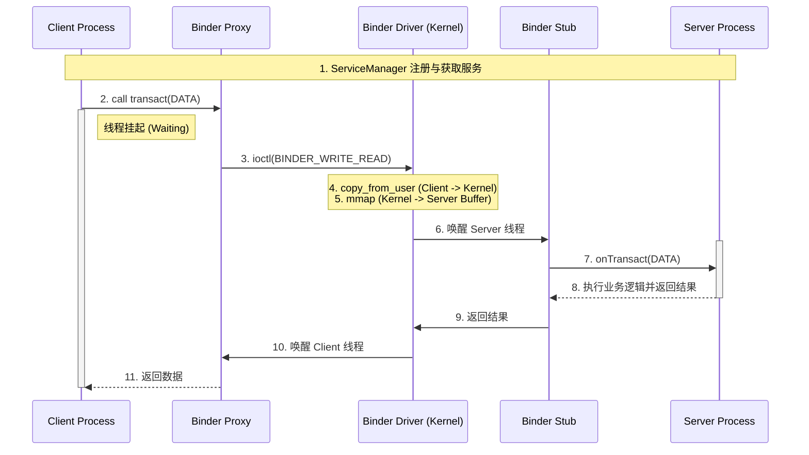

```mermaid
sequenceDiagram
    participant Client as Client Process
    participant Proxy as Binder Proxy
    participant Driver as Binder Driver (Kernel)
    participant Stub as Binder Stub
    participant Server as Server Process

    Note over Client, Server: 1. ServiceManager 注册与获取服务

    Client->>Proxy: 2. call transact(DATA)
    activate Client
    Note right of Client: 线程挂起 (Waiting)
    
    Proxy->>Driver: 3. ioctl(BINDER_WRITE_READ)
    Note over Driver: 4. copy_from_user (Client -> Kernel)<br/>5. mmap (Kernel -> Server Buffer)
    
    Driver->>Stub: 6. 唤醒 Server 线程
    activate Server
    Stub->>Server: 7. onTransact(DATA)
    Server-->>Stub: 8. 执行业务逻辑并返回结果
    deactivate Server
    
    Stub->>Driver: 9. 返回结果
    Driver->>Proxy: 10. 唤醒 Client 线程
    Proxy-->>Client: 11. 返回数据
    deactivate Client
```