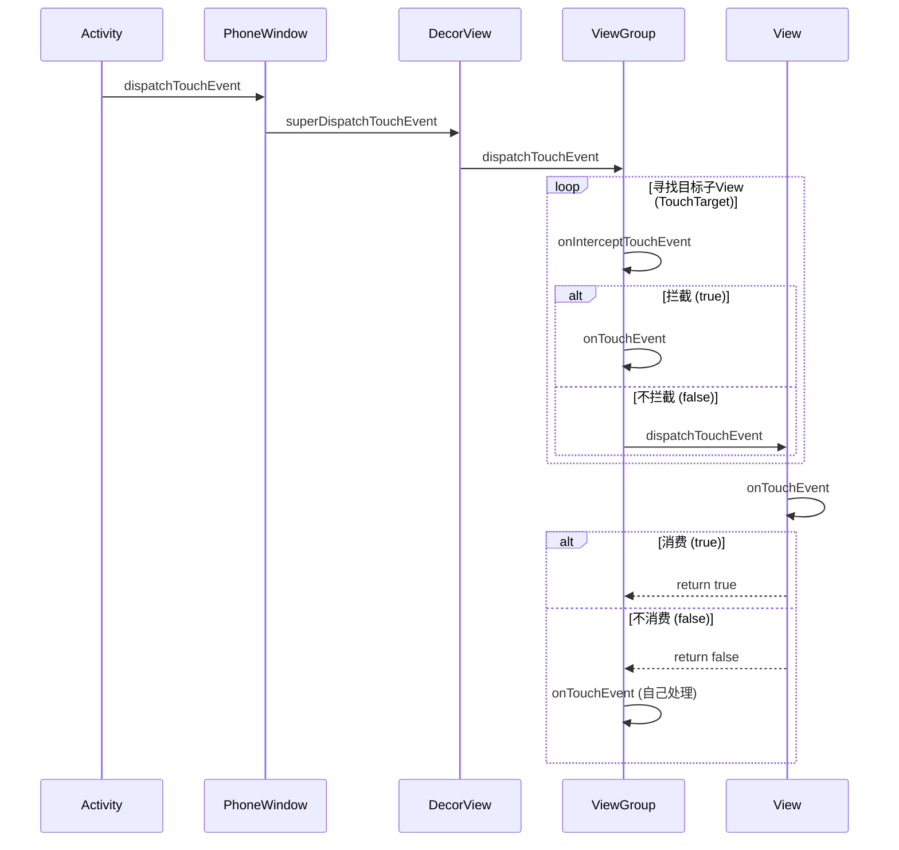

```mermaid
sequenceDiagram
    participant Activity
    participant Window as PhoneWindow
    participant Decor as DecorView
    participant VG as ViewGroup
    participant View

    Activity->>Window: dispatchTouchEvent
    Window->>Decor: superDispatchTouchEvent
    Decor->>VG: dispatchTouchEvent
    
    loop 寻找目标子View (TouchTarget)
        VG->>VG: onInterceptTouchEvent
        alt 拦截 (true)
            VG->>VG: onTouchEvent
        else 不拦截 (false)
            VG->>View: dispatchTouchEvent
        end
    end

    View->>View: onTouchEvent
    alt 消费 (true)
        View-->>VG: return true
    else 不消费 (false)
        View-->>VG: return false
        VG->>VG: onTouchEvent (自己处理)
    end
```