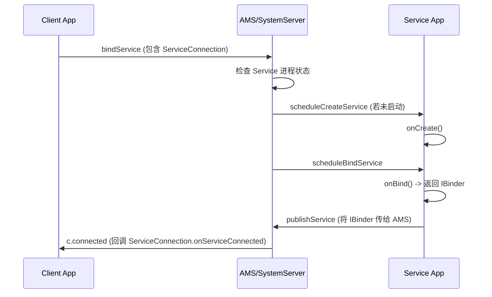

```mermaid
sequenceDiagram
    participant Client as Client App
    participant AMS as AMS/SystemServer
    participant Service as Service App

    Client->>AMS: bindService (包含 ServiceConnection)
    AMS->>AMS: 检查 Service 进程状态
    AMS->>Service: scheduleCreateService (若未启动)
    Service->>Service: onCreate()
    AMS->>Service: scheduleBindService
    Service->>Service: onBind() -> 返回 IBinder
    Service->>AMS: publishService (将 IBinder 传给 AMS)
    AMS->>Client: c.connected (回调 ServiceConnection.onServiceConnected)
```