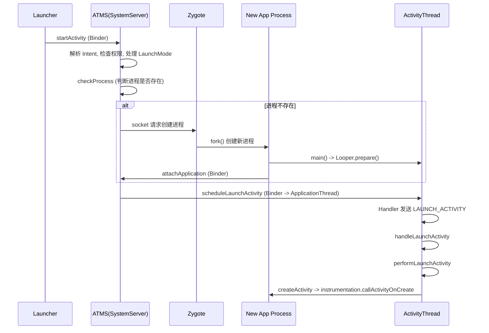

```mermaid
sequenceDiagram
    participant Launcher
    participant ATMS as ATMS(SystemServer)
    participant Zygote
    participant App as New App Process
    participant Thread as ActivityThread

    Launcher->>ATMS: startActivity (Binder)
    ATMS->>ATMS: 解析 Intent, 检查权限, 处理 LaunchMode
    ATMS->>ATMS: checkProcess (判断进程是否存在)
    
    alt 进程不存在
        ATMS->>Zygote: socket 请求创建进程
        Zygote->>App: fork() 创建新进程
        App->>Thread: main() -> Looper.prepare()
        App->>ATMS: attachApplication (Binder)
    end

    ATMS->>Thread: scheduleLaunchActivity (Binder -> ApplicationThread)
    Thread->>Thread: Handler 发送 LAUNCH_ACTIVITY
    Thread->>Thread: handleLaunchActivity
    Thread->>Thread: performLaunchActivity
    Thread->>App: createActivity -> instrumentation.callActivityOnCreate
```