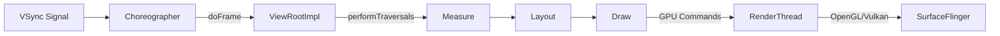

```mermaid
graph LR
    Sync[VSync Signal] --> Choreographer
    Choreographer -->|doFrame| ViewRootImpl
    ViewRootImpl -->|performTraversals| Measure
    Measure --> Layout
    Layout --> Draw
    Draw -->|GPU Commands| RenderThread
    RenderThread -->|OpenGL/Vulkan| SurfaceFlinger
```