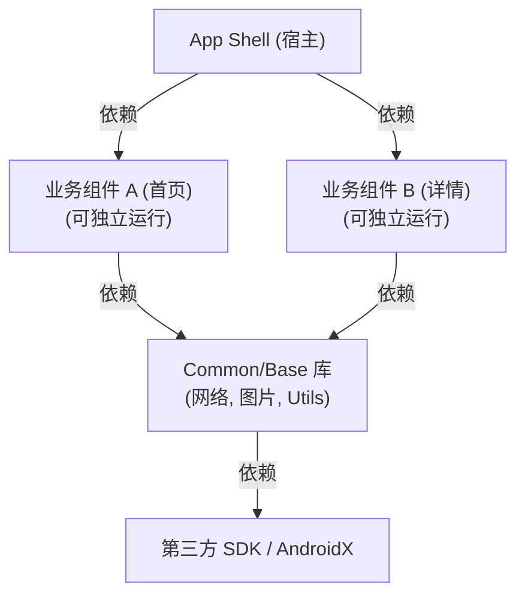

```mermaid
graph TD
    App["App Shell (宿主)"] -->|依赖| BizA["业务组件 A (首页)<br/>(可独立运行)"]
    App -->|依赖| BizB["业务组件 B (详情)<br/>(可独立运行)"]
    BizA -->|依赖| Base["Common/Base 库<br/>(网络, 图片, Utils)"]
    BizB -->|依赖| Base
    Base -->|依赖| SDK["第三方 SDK / AndroidX"]
```