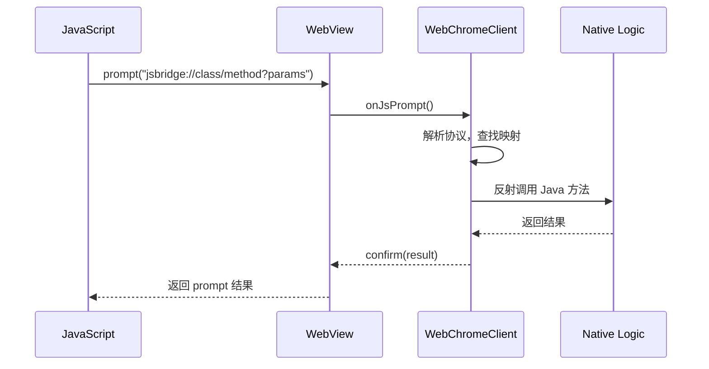

```mermaid
sequenceDiagram
    participant JS as JavaScript
    participant WV as WebView
    participant Native as WebChromeClient
    participant Biz as Native Logic

    JS->>WV: prompt("jsbridge://class/method?params")
    WV->>Native: onJsPrompt()
    Native->>Native: 解析协议，查找映射
    Native->>Biz: 反射调用 Java 方法
    Biz-->>Native: 返回结果
    Native-->>WV: confirm(result)
    WV-->>JS: 返回 prompt 结果
```