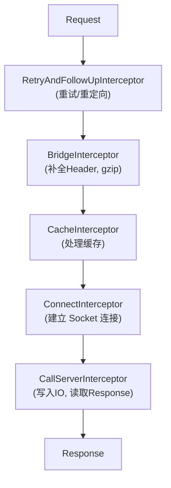

```mermaid
graph TD
    Request["Request"] --> Retry["RetryAndFollowUpInterceptor<br/>(重试/重定向)"]
    Retry --> Bridge["BridgeInterceptor<br/>(补全Header, gzip)"]
    Bridge --> Cache["CacheInterceptor<br/>(处理缓存)"]
    Cache --> Connect["ConnectInterceptor<br/>(建立 Socket 连接)"]
    Connect --> Network["CallServerInterceptor<br/>(写入IO, 读取Response)"]
    Network --> Response["Response"]
```