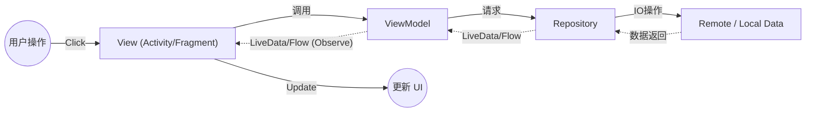

```mermaid
flowchart LR
    %% 节点定义
    User(("用户操作"))
    View["View (Activity/Fragment)"]
    VM["ViewModel"]
    Repo["Repository"]
    Net["Remote / Local Data"]
    UI(("更新 UI"))

    %% 连接线定义
    User -- "Click" --> View
    View -- "调用" --> VM
    VM -- "请求" --> Repo
    Repo -- "IO操作" --> Net
    
    %% 回调/数据流 (使用虚线)
    Net -. "数据返回" .-> Repo
    Repo -. "LiveData/Flow" .-> VM
    VM -. "LiveData/Flow (Observe)" .-> View
    
    View -- "Update" --> UI
```