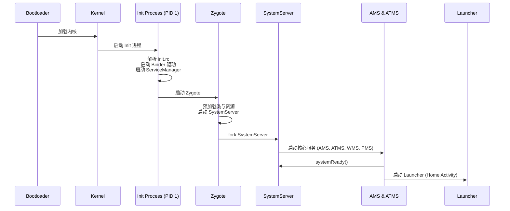

```mermaid
sequenceDiagram
    participant Bootloader
    participant Kernel
    participant Init as Init Process (PID 1)
    participant Zygote
    participant SystemServer
    participant AMS_ATMS as AMS & ATMS
    participant Launcher

    Bootloader->>Kernel: 加载内核
    Kernel->>Init: 启动 Init 进程
    Init->>Init: 解析 init.rc<br/>启动 Binder 驱动<br/>启动 ServiceManager
    Init->>Zygote: 启动 Zygote
    Zygote->>Zygote: 预加载类与资源<br/>启动 SystemServer
    
    Zygote->>SystemServer: fork SystemServer
    SystemServer->>AMS_ATMS: 启动核心服务 (AMS, ATMS, WMS, PMS)
    AMS_ATMS->>SystemServer: systemReady()
    
    AMS_ATMS->>Launcher: 启动 Launcher (Home Activity)
```