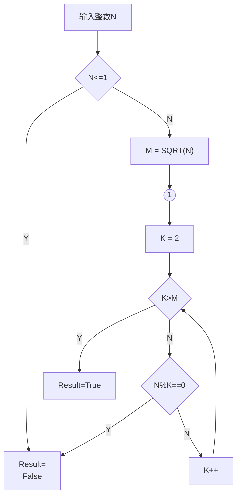

```mermaid
graph TD
    %% 核心修改：将所有文字内容加上双引号，防止特殊符号报错
    Start["输入整数N"]
    DecN{"N<=1"}
    CalcM["M = SQRT(N)"]
    
    %% 连接点1
    Connect1(("1"))
    
    InitK["K = 2"]
    DecK{"K>M"}
    DecMod{"N%K==0"}
    IncK["K++"]
    
    %% 结果节点
    ResFalse["Result=
    False"]
    ResTrue["Result=True"]

    %% 连线逻辑
    Start --> DecN
    DecN -- Y --> ResFalse
    DecN -- N --> CalcM
    CalcM --> Connect1

    Connect1 --> InitK
    InitK --> DecK
    
    DecK -- Y --> ResTrue
    DecK -- N --> DecMod
    
    DecMod -- Y --> ResFalse
    DecMod -- N --> IncK
    IncK --> DecK
```