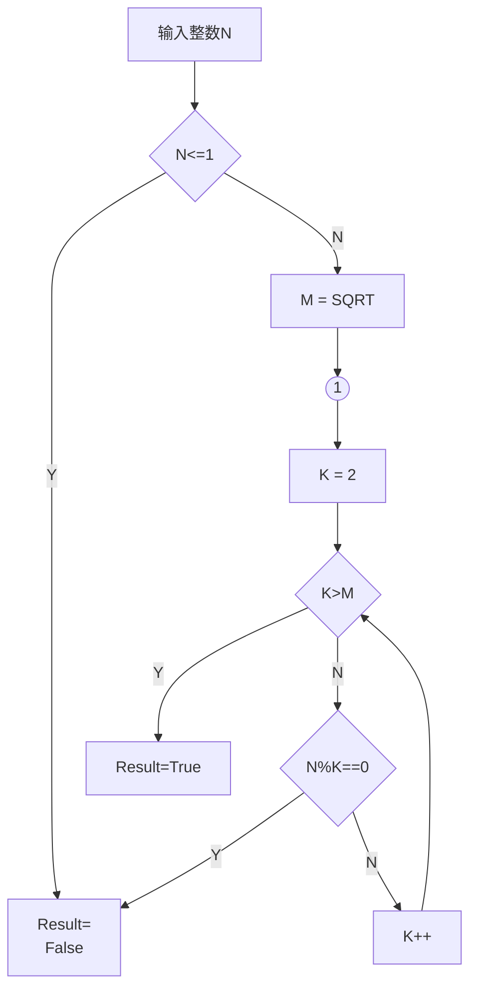

```mermaid
flowchart TD
    %% 定义节点样式和标签
    Start[输入整数N]
    DecN{N<=1}
    CalcM[M = SQRT]
    
    %% 连接点1，用于连接左右两部分逻辑
    Connect1((1))
    
    InitK[K = 2]
    DecK{K>M}
    DecMod{N%K==0}
    IncK[K++]
    
    %% 结果节点
    ResFalse[Result=
    False]
    ResTrue[Result=True]

    %% 连线逻辑 - 左侧部分
    Start --> DecN
    DecN -- Y --> ResFalse
    DecN -- N --> CalcM
    CalcM --> Connect1

    %% 连线逻辑 - 右侧部分
    Connect1 --> InitK
    InitK --> DecK
    
    %% 循环逻辑
    DecK -- Y --> ResTrue
    DecK -- N --> DecMod
    
    DecMod -- Y --> ResFalse
    DecMod -- N --> IncK
    IncK --> DecK
```